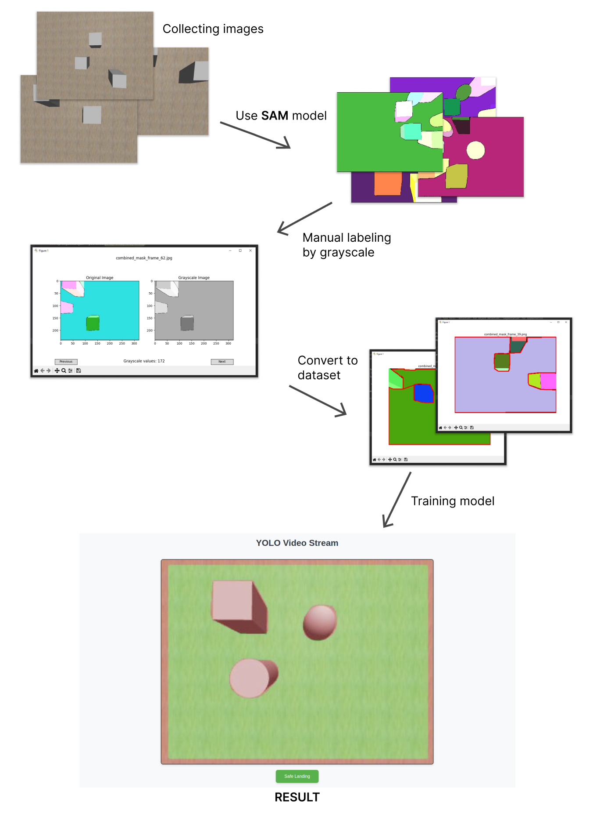

# ONYX PROJECT

**ONYX PROJECT** — это проект, который направлен на создание системы безопасной автономной посадки беспилотных летательных аппаратов (БПЛА) в различных условиях местности. В настоящее время мы используем кастомно обученную модель YOLOv8-seg. В данный момент проект проходит тестирование в симуляторе Gazebo.

## Подготовка к полёту

Подготовка к полёту в конкретной местности включает в себя следующие шаги:

1. Сбор фотографий местности с помощью беспилотного летательного аппарата (БПЛА).
2. Обработка этих изображений с помощью программного обеспечения SAM. Я выполнял эту задачу в Google Colabs.
3. Используя файл grayscale_picker_2.py, необходимо выделить на конкретном изображении зону, подходящую для посадки. Эти данные будут записаны в текстовые файлы в указанной директории.
4. Затем с помощью файла contours_from_segment_auto_gray.py эти данные преобразуются в формат, который можно использовать для обучения модели.
5. С помощью файла segmentation.py на основе этих данных создаётся датасет, готовый для обучения модели.
6. Далее следует стандартный процесс обучения модели.
7. После завершения обучения модель можно использовать!

## Полёт

Чтобы запустить автономную посадку, необходимо выполнить следующие действия:

1. Запустить программу на вычислительном сервере, где будут производиться расчёты. В будущем все расчёты будут выполняться на борту БПЛА.
2. Запустить программу на микрокомпьютере, установленном на беспилотном летательном аппарате (БПЛА).
3. Зайти в веб-интерфейс и в необходимый момент нажать кнопку «SAFE LANDING».

## Схема этапов работы:

